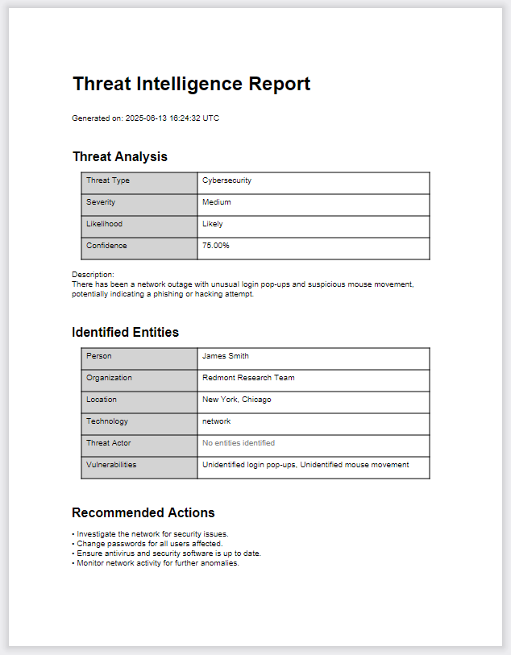

Corvus
# CORVUS


# Getting Started

## Prerequisites

⛏️✨*under construction*✨⛏️

## Installation

1. Set up an account with OpenRouter at https://openrouter.ai/, or use the compatible LLM of your choice (e.g. an OpenAI model)
2. Get a free API Key
3. Clone the repository
4. Install packages
5. Enter your API key
6. Configure your own git remote URL


# Usage

Corvus is an intelligence tool designed to receive and analyze threat conditions using natural language processing and machine learning technology. Its purpose is to augment human decisionmaking by evaluating and prioritizing threats.

It is designed to receive text input, extract critical data points, summarize important details, and give feedback in a report format so that a user can quickly evaluate the data from a high-level view.

A user can programmatically analyze intelligence input, such as a grassroots report to a tip line, and view the output in raw data form or as a document.

## Sample Case
### Input

Here is a sample email report about suspicious network problems sent to a company's IT department. The IT team can triage this message with Corvus.

```text
Subject: Weird network outage happening right now

Hey IT team,

Just wanted to give you a heads up — the network’s been acting super weird since around 10:30 this morning. My laptop keeps dropping connection randomly, and I’ve heard a few others in the office having the same problem. It seems worse near the New York and Chicago offices.

What’s really odd is I noticed some strange pop-ups asking me to enter my login info, but they didn’t look like the usual company login screen — kinda sketchy. I didn’t enter anything, but it felt like some kind of phishing or hack attempt. Also saw my mouse move a bit on its own right before the connection dropped.

No idea if this is part of any planned maintenance or if something else is going on, but figured you’d want to know ASAP. Let me know if you need me to check anything on my end or provide more details.

Thanks!
James Smith with the Redmont Research Team
```

### Output
#### JSON

report_id=None summary=None timeframe=None reporter_info=None entities=Entities(person=['James Smith'], organization=['Redmont Research Team'], location=['New York', 'Chicago'], technology=['network'], threat_actor=[], vulnerabilities=['Unidentified login pop-ups', 'Unidentified mouse movement']) assets_affected=[] impact=[] threat_analysis=ThreatAnalysis(threat_type='Cybersecurity', description='There has been a network outage with unusual login pop-ups and suspicious mouse movement, potentially indicating a phishing or hacking attempt.', severity='Medium', likelihood='Likely', recommended_actions=['Investigate the network for security issues.', 'Change passwords for all users affected.', 'Ensure antivirus and security software is up to date.', 'Monitor network activity for further anomalies.']) confidence=0.75 raw_message=None

#### PDF Report


# Contributing

# License

# Contact

# Developer Notes

Dependencies may include some unused packages during development.